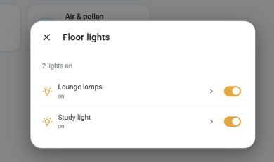
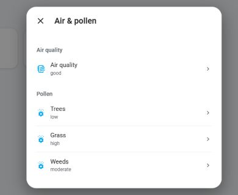
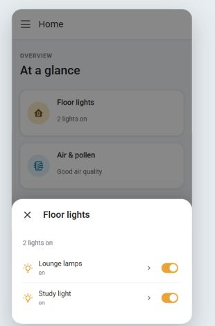
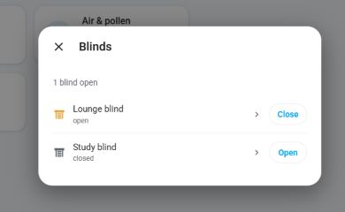

# Entity Popup Card

[](https://my.home-assistant.io/redirect/hacs_repository/?owner=alphasixtyfive&repository=entity-popup-card&category=plugin)

A small Home Assistant dashboard card that opens a live list of related entities. I use it for groups of lights and for a few sensor summaries. The popup keeps the quick actions close at hand; tapping a row can open Home Assistant's own more-info dialog when you want the full controls or history.

It works with the built-in Tile card. If you already use Mushroom template cards, you can keep those too.

The maintained source is in [`src/`](src/). The root `entity-popup-card.js` is generated from those files so HACS can install one JavaScript resource.

## Screenshots

These previews use example entities. The popup picks up your Home Assistant theme.

| Light controls | Air & pollen |
| --- | --- |
|  |  |

On a phone, the same popup opens as a bottom sheet:



## Install

Click the HACS button above, then download the repository. If the button does not find it yet, add `https://github.com/alphasixtyfive/entity-popup-card` in **HACS → Custom repositories**, select **Dashboard**, and download it. Refresh Home Assistant after installation.

HACS normally registers the dashboard resource. If you need to add it yourself, use **Settings → Dashboards → Resources**:

```yaml
url: /hacsfiles/entity-popup-card/entity-popup-card.js
type: module
```

For a manual install, copy `entity-popup-card.js` to `/config/www/` and register `/local/entity-popup-card.js` as a JavaScript module.

The card also appears in Home Assistant's **Add Card** picker. Its starter configuration uses a built-in Tile card; edit the YAML to list the entities you want in the popup.

## Light group

This shows lights that are on. The name opens the light's normal more-info dialog; the switch beside it turns the light off. A light you turn off stays in the open popup so you can turn it back on. The tile icon toggles the whole group.

```yaml
type: custom:entity-popup-card
entity: light.downstairs
card:
  type: tile
  entity: light.downstairs
  icon_tap_action:
    action: toggle
popup:
  title: Downstairs lights
  sections:
    - source: members
      recursive: true
      domain: light
      mode: controls
      show: active
      row_action: more-info
      show_state: true
      singular: light
      plural: lights
      active_label: "on"
      empty_text: All lights are off.
```

`members` reads the group's `entity_id` attribute. If your group uses another attribute, set `attribute:` in the section.

## A short sensor list

The popup can also show selected readings. It keeps your chosen order and uses Home Assistant's state formatting, including units and translated states when available.

```yaml
type: custom:entity-popup-card
entity: sensor.outdoor_air_quality
card:
  type: tile
  entity: sensor.outdoor_air_quality
popup:
  title: Air & pollen
  sections:
    - title: Air quality
      source: entities
      entities:
        - sensor.outdoor_air_quality
      show_state: true
      row_action: more-info
    - title: Pollen
      source: entities
      entities:
        - entity: sensor.tree_pollen
          name: Trees
        - entity: sensor.grass_pollen
          name: Grass
        - entity: sensor.weed_pollen
          name: Weeds
      show_state: true
      row_action: more-info
```

## Individual switches

For a fixed set of on/off entities, use `source: entities` with `mode: controls`. The card calls each entity's own domain service, so a list can contain lights, switches, fans, and input booleans.

```yaml
type: custom:entity-popup-card
entity: switch.desk
card:
  type: tile
  entity: switch.desk
popup:
  title: Desk
  sections:
    - source: entities
      entities:
        - switch.desk
        - light.desk_lamp
      mode: controls
      row_action: more-info
```

## Covers

Covers get **Open** and **Close** buttons instead of switches. While a cover is opening or closing, the button waits for its next state. Tap the row name for Home Assistant's full cover controls, including position and tilt where supported.



```yaml
type: custom:entity-popup-card
entity: cover.living_room
card:
  type: tile
  entity: cover.living_room
popup:
  title: Blinds
  sections:
    - source: entities
      entities:
        - cover.living_room
        - cover.bedroom
      mode: controls
      show_state: true
      row_action: more-info
```

## Mushroom tiles

If you leave out `card:`, the card wraps a Mushroom template card. Put Mushroom's usual `primary`, `secondary`, `icon`, and `icon_tap_action` settings at the top level. Install Mushroom separately. The popup handles the tile's tap action, so you do not need to set `tap_action: fire-dom-event`.

```yaml
type: custom:entity-popup-card
entity: light.downstairs
primary: Downstairs lights
secondary: "{{ states(entity) | title }}"
icon: mdi:home-floor-0
icon_tap_action:
  action: toggle
popup:
  sections:
    - source: members
      domain: light
      mode: controls
      show: active
      row_action: more-info
```

The [configuration reference](docs/configuration.md) covers the other sources, row details, and status options.

## Development

The files in `src/` are the source of truth. Run `npm ci`, edit the source, then run `npm run build` to update the HACS file. `npm test` checks the behavior and confirms that the generated file matches the source. It has been tested with Home Assistant 2026.9.3.

The dialog follows Home Assistant's current [more-info layout](https://github.com/home-assistant/frontend/blob/dev/src/dialogs/more-info/ha-more-info-dialog.ts) and [dashboard card API](https://developers.home-assistant.io/docs/frontend/custom-ui/custom-card/). The row details stay native; this card does not copy Home Assistant's light color, brightness, or history controls.
